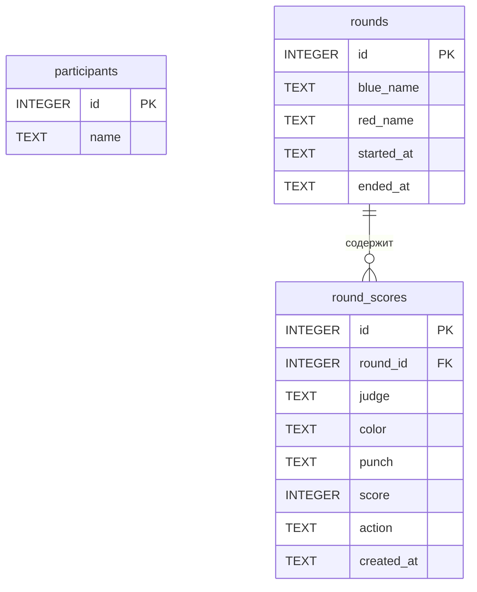

# ГЛАВА 2. ПРОЕКТИРОВАНИЕ ИНФОРМАЦИОННОЙ СИСТЕМЫ ПОДДЕРЖКИ ПРОЦЕССА СПОРТИВНОГО СУДЕЙСТВА

Первая глава дала представление о предметной области и о том, как устроено судейство в армейском рукопашном бое. Опираясь на эти результаты, перейдём к проектированию информационной системы, которая должна это судейство поддержать. Работа в главе разбита на несколько связанных шагов: сначала определяется, что система обязана делать и какой она должна быть по качеству, затем обосновывается выбор технологий, и уже на этой основе описываются сценарии работы пользователей, клиент-серверная архитектура и структура данных будущего приложения.

## 2.1 Функциональные требования к системе

Функциональные требования отвечают на вопрос о том, что система делает: какие данные принимает на вход, какие результаты выдаёт и как реагирует на действия пользователя. Этим они отличаются от нефункциональных, описывающих не состав функций, а качество их выполнения. Зафиксировать такой перечень необходимо в самом начале — он очерчивает границы разработки, ложится в основу архитектуры и модели данных и позже служит мерой того, всё ли реализовано.

Список требований к разрабатываемой системе опирается на два источника: регламент поединков по армейскому рукопашному бою и состав судейской бригады. Судит поединок коллегия из четырёх человек — главный судья и три боковых. Главное, что от системы ожидается, — собирать оценки боковых судей в реальном времени, автоматически их суммировать и выводить итог поединка. Отсюда вытекает приведённый ниже перечень.

1. Управление участниками поединка. Главный судья вводит фамилию, имя и отчество двух бойцов раунда — выступающего в синем углу и выступающего в красном. Вводимые имена подсказываются по справочнику участников из базы данных. Запуск поединка с незаполненными полями не допускается: форма создания раунда проверяет это перед стартом. Если же боец в справочнике не найден, система предлагает сохранить его, чтобы в дальнейшем имя подставлялось автоматически.

2. Подключение и состав судейской коллегии. Чтобы боковым судьям не приходилось вручную набирать сетевой адрес, главный судья показывает QR-код со ссылкой на страницу подключения в локальной сети. Судья регистрируется под собственным именем, после чего с сервером устанавливается постоянное соединение. Имена контролируются на уникальность — повторное подключение под уже занятым именем сервер отклоняет. Список подключившихся судей виден главному судье, и он же может принудительно отключить любого из них; отключаемый судья получает об этом уведомление.

3. Регистрация оценок в реальном времени. Боковой судья выставляет баллы в трёх категориях технических действий: удар рукой — 1 или 2 балла, удар ногой и бросок — от 1 до 3 баллов. Отдельно предусмотрен модификатор «Н» (нокдаун): он прибавляет 3 балла к последней оценке в соответствующей категории. Нарушения фиксируются двумя кнопками — замечание даёт сопернику нарушителя 1 балл, предупреждение — 2 балла. Для самоконтроля рядом с каждой кнопкой судья видит счётчик нажатий. Любая оценка немедленно уходит на сервер и попадает в интерфейс главного судьи.

4. Отмена ошибочных действий. Последнее действие — будь то оценка, замечание или предупреждение — боковой судья может отменить. Особый случай — модификатор «Н»: при его отмене снимается только сам модификатор, а базовая оценка остаётся. Отмена тут же отражается в сводной таблице главного судьи.

5. Сводная таблица у главного судьи. Таблица показывает оценки всех трёх боковых судей, разнесённые по категориям действий и по углам — отдельно для синего и красного бойца. По каждому судье автоматически считается сумма баллов участника с учётом модификатора «Н» и штрафных баллов за нарушения соперника. Тот, у кого по мнению конкретного судьи сумма больше, получает от него одно судейское очко; финальный счёт поединка складывается из этих очков (например, 2:1 или 3:0).

6. Ход раунда. Раунд запускает главный судья, и вместе с запуском стартует таймер; на экране видно прошедшее с начала раунда время. По завершении раунда все подключённые боковые судьи получают автоматическое уведомление.

7. Ничейная ситуация (тайбрейк). Если по итогам раунда у какого-либо бокового судьи баллы участников совпали, система сама это обнаруживает и выводит этому судье диалог с просьбой указать победителя раунда. Выбор судьи учитывается при подсчёте финального счёта.

8. Справочник участников. Перечень участников хранится в базе данных постоянно. Пополняется он двумя путями — при создании раунда и по подтверждению главного судьи. Дубликаты исключаются контролем уникальности имени.

9. Восстановление состояния поединка. Все оценки текущего раунда сервер держит у себя, поэтому при обновлении страницы или переподключении главного судьи сводная таблица восстанавливается из накопленных данных. Кратковременный сбой связи не приводит к потере уже выставленных оценок.

Девять пунктов охватывают поединок от начала до конца — от регистрации бойцов и сбора коллегии до подсчёта итога и разбора спорных моментов. Важно, что за каждым стоит реальное действие судьи или организатора, а не абстрактная «функция ради функции».

Заодно перечень намечает, из чего система будет складываться: управление раундом, сбор оценок, подсчёт результатов, хранение справочных данных. От него и пойдём дальше — сначала к выбору технологий, потом к архитектуре.

## 2.2 Обоснование выбора технологий и инструментов разработки

От выбора стека зависит многое — трудоёмкость разработки, быстродействие, требования к развёртыванию и то, насколько удобно систему потом сопровождать. Поэтому инструменты подбирались не произвольно, а по набору критериев, продиктованных спецификой задачи:

- обмен данными в реальном времени: оценка бокового судьи должна появляться у главного без ощутимой задержки;
- автономность — работа в локальной сети без выхода в Интернет, ведь стабильной связи в спортивном зале часто попросту нет;
- кроссплатформенность клиента: пульт бокового судьи обязан открываться на телефонах под iOS и Android, причём без установки отдельного приложения;
- простота развёртывания — запуск на одном компьютере организатора, без трудоёмкой настройки серверной инфраструктуры;
- открытость и бесплатность инструментов, чтобы избежать лицензионных расходов;
- наконец, скорость разработки и наличие готовых компонентов.

Архитектурно система строится как клиент-серверная с веб-клиентом. Такой подход даёт одну общую кодовую базу клиента на все устройства: и главный судья, и боковые работают в обычном браузере, а подключение телефона сводится к сканированию QR-кода. Вариант с нативными мобильными приложениями рассматривался, но был отброшен — он означал бы отдельную разработку под каждую платформу, прохождение модерации в магазинах и заметно более сложное развёртывание прямо на площадке.

Клиентская часть написана на ReactJS 18 со сборщиком Vite. React удобен своим компонентным, декларативным подходом: интерфейс собирается из компонентов с собственным состоянием, а представление само обновляется вслед за данными. Для нашей задачи это решающее свойство — сводная таблица главного судьи перестраивается на каждой новой оценке, и React делает это штатно, без ручных манипуляций с DOM. Vite берёт на себя быструю пересборку при разработке и сборку оптимизированного пакета статики, который потом раздаёт сервер. Переходы между экранами — создание раунда, таблица главного судьи, подключение и пульт бокового судьи — реализованы через React Router: каждому экрану в одностраничном приложении соответствует свой адрес.

Готовые элементы интерфейса берутся из Material UI. Кнопки, поля с автодополнением, диалоги, счётчики — всё это библиотека предоставляет в адаптивном виде, по канонам дизайн-системы Material Design. На практике MUI заметно сократил время на вёрстку и, что важнее для пульта бокового судьи, обеспечил аккуратное поведение элементов управления на сенсорных экранах телефонов.

Сервер сделан на Python и фреймворке FastAPI. В пользу FastAPI говорило сразу несколько соображений. Во-первых, встроенная поддержка асинхронной обработки запросов и протокола WebSocket — без него двусторонний обмен в реальном времени не построить. Во-вторых, входные и выходные данные строго типизируются моделями Pydantic, и это снижает риск ошибок при передаче оценок. В-третьих, документация API по спецификации OpenAPI генерируется автоматически, что облегчает отладку и тестирование. Добавим высокую производительность в связке с ASGI-сервером Uvicorn и компактность кода: Flask потребовал бы сторонних расширений ради того же WebSocket и валидации, а Django для системы без развитой административной части оказался бы избыточен.

Чтобы автогенерируемая документация работала и без Интернета — не подтягивая ресурсы со сторонних CDN, — подключён пакет fastapi-offline. Это согласуется с требованием полной автономности системы.

Обмен между клиентом и сервером идёт по двум каналам. Команды, которые инициирует пользователь, — создание раунда, отправка оценки, отмена действия — уходят обычными REST-запросами по HTTP с телом в формате JSON. А вот уведомления со стороны сервера — новая оценка для главного судьи, изменение списка судей, конец раунда — доставляются по WebSocket, который держит постоянное двустороннее соединение с минимальной задержкой. Связка REST и WebSocket для систем реального времени вполне типична и удобно разводит ответственность: клиент меняет состояние через REST, сервер шлёт свои push-уведомления через WebSocket.

Базу данных решено держать на встраиваемой СУБД SQLite. Постоянно хранить нужно немного — по сути, один справочник участников, — так что полноценная клиент-серверная СУБД вроде PostgreSQL или MySQL была бы здесь излишеством и противоречила бы требованию простоты установки. SQLite не требует отдельного серверного процесса, держит данные в одном файле и входит в стандартную библиотеку Python — ровно то, что нужно для запуска на единственном компьютере организатора соревнований.

Развёртывается система как единый дистрибутив. Клиент собирается командой Vite в каталог статических файлов, а сервер FastAPI отдаёт эту собранную одностраничную сборку вместе со своим программным интерфейсом. В итоге для старта хватает одного Python-процесса на машине главного судьи, к которому остальные устройства подключаются по локальной сети Wi-Fi. Чтобы не вводить адрес руками, сервер сообщает свой IP-адрес в локальной сети — по нему и строится QR-код страницы подключения судей.

Сводно технологический стек показан в таблице 2.1.

Таблица 2.1 — Технологический стек проектируемой системы

| Уровень системы | Технология | Назначение и обоснование выбора |
|---|---|---|
| Клиентская часть | ReactJS 18 | Компонентная архитектура, декларативное обновление интерфейса в реальном времени |
| Сборка клиента | Vite | Быстрая сборка, оптимизированный производственный пакет |
| Интерфейсные компоненты | Material UI | Готовые адаптивные компоненты для настольных и мобильных браузеров |
| Маршрутизация | React Router | Навигация между страницами одностраничного приложения |
| Генерация QR-кодов | qrcode.react | Формирование QR-кода подключения судей |
| Серверная часть | Python, FastAPI | Асинхронная обработка, поддержка WebSocket, валидация данных Pydantic |
| ASGI-сервер | Uvicorn | Запуск приложения FastAPI |
| Автономная документация | fastapi-offline | Работа документации API без доступа к сети Интернет |
| СУБД | SQLite | Встраиваемая база данных без отдельного серверного процесса |
| Обмен в реальном времени | WebSocket | Двунаправленный канал доставки оценок и уведомлений |

Так закрываются все критерии, с которых мы начинали: обмен в реальном времени, автономность в локальной сети, клиент на любой платформе и запуск одним серверным процессом. Лицензии у всех компонентов открытые — платить не за что, да и дальнейшему развитию проекта это только на руку.

## 2.3 Постановка задачи проектирования и разработки

Постановка задачи — это место, где сходятся цель, ограничения и требования; на неё потом опираются все остальные решения. Зафиксируем здесь цель проекта, объект автоматизации, роли пользователей и сам состав требований — и функциональных, и нефункциональных.

Цель — построить клиент-серверное приложение, которое в реальном времени собирает индивидуальные оценки судей, само их подсчитывает и выводит итог поединка по дисциплине армейского рукопашного боя.

Объект автоматизации — само судейство, то, как проводится и оценивается поединок. Сегодня боковые судьи записывают оценки в бумажные протоколы, а потом результаты вручную сводят и пересчитывают; отсюда и задержки с объявлением итога, и арифметические ошибки, и поводы для споров. Наша система убирает бумажную прослойку: решение бокового судьи фиксируется сразу, а итог машина считает сама по заданным правилам.

Пользователей у системы две категории.

Главный судья работает за стационарным компьютером или ноутбуком, где запущен сервер. В его интерфейсе создаётся раунд и вводятся участники, подключаются и отключаются боковые судьи, управляется ход раунда — запуск, таймер, завершение, — и здесь же выводится сводная таблица оценок и финальный счёт.

Боковых судей трое, и каждый работает со своего мобильного устройства, подключаясь по QR-коду. Их задача — выставлять оценки по категориям технических действий, отмечать замечания и предупреждения, отменять собственные ошибки и, если случилась ничья, называть победителя.

Сами функциональные требования подробно расписаны в разделе 2.1; всего их девять групп — от управления участниками и судейской коллегией до восстановления состояния поединка. Повторять их здесь нет необходимости, а вот качественные, нефункциональные требования стоит выделить отдельно.

Надёжность. Накопленные за раунд оценки сервер обязан сохранять и возвращать в таблицу главного судьи после обновления страницы или короткого обрыва связи. Повторное подключение под занятым именем должно отклоняться, иначе оценки задублируются. Любое действие бокового судьи обязано отменяться функцией отмены последнего действия. И ни в чём из этого система не должна зависеть от наличия Интернета.

Безопасность. Система функционирует в изолированной локальной сети мероприятия, и это само по себе сужает круг возможных источников несанкционированного доступа. Все обращения к базе идут только параметризованными запросами — защита от SQL-инъекций. Персональных данных система практически не хранит: лишь фамилии, имена и отчества участников, и те вносятся с согласия организаторов соревнований.

Производительность. Между нажатием кнопки на устройстве бокового судьи и появлением оценки в таблице главного должно проходить не более 200 мс в условиях локального Wi-Fi. При этом одновременную отправку оценок всеми тремя судьями система обязана выдерживать без сбоев.

Масштабируемость. Менять число подключаемых судей нужно без переделки серверной части. Закладывается и запас на развитие — ведение истории раундов, экспорт протоколов, поддержка нескольких площадок сразу; конкретные направления уточнятся позже.

Удобство. Пульт бокового судьи рассчитан на мобильное устройство и на цейтнот: крупные кнопки, минимум действий ради одной оценки. Цвета углов — синий и красный — выдержаны одинаково во всех интерфейсах системы. Сводная таблица показывает оценки всех судей по обоим бойцам сразу, без прокрутки. А подключение, как уже сказано, обходится без ручного ввода сетевого адреса — только сканирование QR-кода.

Собрав всё это вместе, задачу проектирования можно сформулировать так: разработать клиент-серверное веб-приложение, которое работает в локальной сети без доступа к Интернету, подключает главного и трёх боковых судей, в реальном времени — с задержкой до 200 мс — собирает и передаёт судейские оценки, само считает финальный счёт по правилам армейского рукопашного боя и постоянно хранит справочник участников.

Перечисленные нефункциональные требования — надёжность, безопасность, производительность, масштабируемость, удобство — не абстрактны: каждое из них так или иначе скажется на архитектуре, к которой мы придём в разделе 2.5. Но прежде стоит описать, как пользователи будут работать с системой, — этим займёмся в следующем разделе.

## 2.4 Описание бизнес-процессов и сценариев использования системы

Прежде чем писать код, стоит описать, как с системой будут работать люди, — для этого и нужны сценарии использования (use case). У каждого есть цель, действующие лица (акторы), предусловия, основной ход событий, отклонения и итог. Польза двойная: сценарий перекидывает мост от требований к интерфейсам — позже он ляжет на конкретные экраны и точки программного интерфейса. Всего сценариев восемь; как они распределяются между «Главным судьёй» и «Боковым судьёй», видно на диаграмме вариантов использования (рисунок 2.1).

Если же смотреть на поединок целиком, процесс выстраивается в цепочку: создание раунда и ввод участников → подключение боковых судей → сам раунд с выставлением оценок → его завершение → при необходимости тайбрейк → объявление финального счёта. Эта цепочка показана в нотации BPMN на рисунке 2.2.

Сценарий 1. Создание нового раунда.
Главный судья открывает начальную страницу запущенного приложения и заводит раунд: вводит ФИО бойцов синего и красного углов, причём имена подсказываются по справочнику. Прежде чем зарегистрировать пару на сервере и перейти к сводной таблице, система убеждается, что оба поля заполнены, — с пустым полем раунд просто не создастся, выскочит сообщение об ошибке. Если введённого имени в справочнике нет, система спросит, сохранять ли нового участника: можно согласиться, можно продолжить без сохранения. К концу сценария оба бойца зарегистрированы, и их имена видны всем, кто будет подключаться.

Сценарий 2. Подключение бокового судьи.
Раунд уже создан, телефон судьи — в той же сети, что и сервер. Главный судья открывает диалог с QR-кодом, где зашит адрес страницы подключения; боковой судья наводит камеру, переходит по ссылке, вводит своё имя и подтверждает вход. Сервер устанавливает постоянное WebSocket-соединение, открывает пульт оценок, а имя нового судьи сразу появляется в списке у главного — и под него заводятся столбцы в таблице. Что может помешать: имя уже занято (тогда сервер отклонит соединение) или сам сервер недоступен (судья увидит ошибку соединения).

Сценарий 3. Выставление оценки боковым судьёй.
Это основной рабочий сценарий — судья подключён, раунд идёт. Судья нажимает кнопку нужной категории (удар рукой — 1 или 2 балла, удар ногой и бросок — 1–3 балла) на той половине экрана, что отвечает синему или красному бойцу. Оценка уходит на сервер, тот по WebSocket передаёт её главному судье; в таблице она встаёт в свою ячейку, суммы и счёт пересчитываются, счётчик на кнопке прибавляется. Нокдаун судья отмечает кнопкой «Н» — она добавляет 3 балла к последней оценке этой же категории (нажатие без предыдущей оценки, как и повторное нажатие, игнорируется); нарушение — кнопками «Замечание» (+1 балл сопернику) и «Предупреждение» (+2 балла). Каждое такое действие откладывается в историю судьи — вдруг придётся отменять.

Сценарий 4. Отмена последнего действия.
Когда в истории судьи есть хотя бы одно действие, последнее можно откатить. Судья нажимает кнопку отмены, система находит это действие и отправляет на сервер запрос, сервер передаёт отмену главному судье, оценка исчезает из ячейки, суммы пересчитываются. Тонкость одна: если последним был модификатор «Н», снимется только он — базовая оценка останется на месте. Так ошибочное действие выпадает из подсчёта на всех уровнях.

Сценарий 5. Управление ходом раунда.
Раундом распоряжается главный судья. Он запускает раунд — одновременно идёт таймер, и на экране растёт прошедшее время, — а по окончании поединка завершает его, после чего сервер рассылает боковым судьям уведомление. Если у кого-то из судей баллы сошлись поровну, вместо обычного завершения включается тайбрейк (сценарий 6). По итогу раунд закрыт, судьи оповещены, финальный счёт зафиксирован.

Сценарий 6. Разрешение ничейной ситуации (тайбрейк).
Тайбрейк срабатывает, когда раунд завершён, а суммы синего и красного у конкретного бокового судьи равны. Система показывает этому судье диалог о равенстве очков с кнопками выбора; судья указывает, кому отдать победу; решение уходит на сервер и идёт в зачёт судейских очков, а финальный счёт в таблице главного обновляется. Как поступать, если судья откажется выбирать, оставлено на усмотрение правил соревнований. В результате голос судьи учтён, а счёт поединка определён.

Сценарий 7. Принудительное отключение судьи.
Иногда судью нужно убрать из текущего поединка — например, при замене или ошибочном подключении. Главный судья нажимает значок отключения рядом с именем в таблице и подтверждает действие в появившемся диалоге; сервер разрывает WebSocket-соединение, на устройстве судьи возникает надпись «Вы были отключены главным судьёй», список судей обновляется. Откажется подтвердить — ничего не происходит. В итоге судья выведен из коллегии, а его устройство возвращается на страницу подключения.

Сценарий 8. Ведение справочника участников.
Этот сценарий работает в фоне и копит базу участников, чтобы в следующих раундах не вводить их заново. При создании раунда система берёт перечень участников с сервера и подставляет его в автодополнение; новое имя предлагает сохранить, и после подтверждения запись попадает в базу. Повторный ввод уже существующего имени система просто проигнорирует — контроль уникальности не даст создать дубликат. Так справочник понемногу пополняется.

Восемь сценариев в сумме закрывают все функциональные требования из раздела 2.1 и раскладывают их по двум ролям. Видно и кое-что важное для дальнейшего: сценарии с оценками и их отменой (3 и 4) задают требования к каналу обмена в реальном времени, а сценарии 1 и 8 — к подсистеме постоянного хранения данных. С опорой на них в следующем разделе проектируется клиент-серверная архитектура.

## 2.5 Описание клиент-серверной архитектуры

Клиент-серверная модель делит обязанности: сервер централизованно обрабатывает запросы и хранит данные, а клиенты заняты пользовательским интерфейсом. В случае веб-приложения клиент — это браузер с загруженным одностраничным приложением, а сервер отвечает на программные запросы и распоряжается данными. Нам это удобно сразу по нескольким причинам: логика и состояние собраны в одном месте, клиент не привязан к платформе, и все участники одновременно видят одно и то же согласованное состояние — без чего синхронное судейство, собственно, и не имело бы смысла.

Архитектура системы делится на три логических уровня; общая схема их взаимодействия — на рисунке 2.3.

Уровень представления — это одностраничное приложение на ReactJS, работающее в браузерах устройств пользователей. В нём четыре страницы, привязанные к маршрутам: создание раунда («/»), сводная таблица главного судьи («/table»), подключение бокового судьи («/connect») и его же пульт оценок («/mobile»). На клиенте лежат отображение данных, проверка пользовательского ввода, локальный подсчёт сумм и счёта в таблице главного судьи, а также поддержание WebSocket-соединения с сервером.

Уровень приложения — сервер на FastAPI под управлением ASGI-сервера Uvicorn, запущенный на машине главного судьи. У сервера четыре круга задач: обрабатывать REST-запросы клиентов (регистрация участников, приём оценок, команды управления); вести WebSocket-соединения и маршрутизировать сообщения между судьями; держать оперативное состояние поединка в памяти процесса; раздавать статику собранного клиентского приложения — благодаря чему отдельный веб-сервер не нужен.

Уровень данных — встраиваемая СУБД SQLite со справочником участников в локальном файле базы. К базе обращается только серверная часть, и только параметризованными SQL-запросами.

Ядро серверной части — менеджер соединений (ConnectionManager). Этот модуль держит реестр активных WebSocket-соединений боковых судей, отдельно соединение главного судьи и текущую пару участников раунда. По сути он работает диспетчером сообщений: пришла оценка по REST — он сразу же пересылает её в WebSocket-канал главного судьи; сменился состав судей — рассылает обновлённый список; назначили участников — сообщает подключённым судьям их имена.

Клиент и сервер общаются по двум каналам, и делятся они по тому, кто проявляет инициативу.

Первый канал — REST-запросы, инициатива на стороне клиента. Пользовательские команды идут HTTP-запросами с телом в JSON. Основные конечные точки программного интерфейса сведены в таблицу 2.2.

Таблица 2.2 — Конечные точки программного интерфейса системы

| Метод | Адрес | Назначение |
|---|---|---|
| POST | /connect_judge | Регистрация подключения бокового судьи |
| GET | /local_ip | Получение IP-адреса сервера для формирования QR-кода |
| GET | /kick_judge/{judge} | Принудительное отключение судьи |
| POST | /send_score | Передача оценки бокового судьи |
| POST | /undo_score | Отмена последнего действия судьи |
| POST | /connect_participants | Назначение участников раунда |
| GET | /participants | Получение участников текущего раунда |
| GET | /scores | Получение всех оценок текущего раунда |
| POST | /round_end | Завершение раунда |
| POST | /tiebreaker | Передача решения судьи при ничейном результате |
| GET | /db/participants | Получение справочника участников из базы данных |
| POST | /db/participants | Добавление участника в справочник |
| POST | /round_start | Запуск раунда и создание записи в журнале раундов |
| GET | /db/rounds | Получение списка прошедших раундов из базы данных |
| GET | /db/rounds/{round_id}/scores | Получение хронологического журнала оценок конкретного раунда |
| WS | /ws/{judgeName} | Установление WebSocket-соединения судьи |

Второй канал — WebSocket-сообщения, инициатива на стороне сервера. Каждый судья, входя в систему, устанавливает постоянное соединение по адресу «/ws/{имя судьи}»; за главным судьёй закреплено зарезервированное имя mainJudge. По этому каналу сервер шлёт уведомления, перечисленные в таблице 2.3.

Таблица 2.3 — Типы WebSocket-сообщений системы

| Сообщение | Получатель | Содержание |
|---|---|---|
| judgeupd | Главный судья | Актуальный список подключённых боковых судей |
| score | Главный судья | Новая оценка: судья, участник (цвет), категория, балл |
| undo | Главный судья | Отмена последнего действия судьи |
| participantupd | Боковые судьи | Имена участников текущего раунда |
| kicked | Боковой судья | Уведомление о принудительном отключении |
| roundend | Боковые судьи | Уведомление о завершении раунда |

Если проследить путь одной оценки целиком, выходит такая цепочка: нажатие кнопки на мобильном устройстве → POST-запрос /send_score с JSON-объектом оценки → проверка данных моделью Pydantic на сервере → пересылка менеджером соединений в WebSocket-канал главного судьи → обновление состояния React-компонента таблицы → автоматический пересчёт сумм и финального счёта. Эта последовательность изображена на рисунке 2.4. Все узлы находятся в одной локальной сети, поэтому суммарная задержка цепочки укладывается в требуемые 200 мс.

Безопасность держится на нескольких опорах. Первая и главная — изоляция: система развёртывается в локальной сети мероприятия и не имеет входов из сети Интернет, что само по себе резко сужает поверхность атаки. Вторая — контроль имён: попытку открыть WebSocket-соединение под занятым именем сервер отклоняет, закрывая соединение особым кодом, и тем самым не даёт перехватить чужую судейскую сессию внутри сети. Третья — параметризованные запросы к базе, которые исключают SQL-инъекции через поле имени участника. От полноценной аутентификации пользователей мы сознательно отказались: модель угроз изолированной локальной сети этого не требует, а подключение судьи должно занимать секунды, а не минуты. Введение токенов доступа остаётся возможным направлением развития системы.

Разнесение по уровням облегчает сопровождение: клиент можно дорабатывать независимо от сервера, пока соблюдается контракт программного интерфейса, а смена СУБД клиентской части вообще не касается. Масштабируемость в пределах целевого сценария достигается самой архитектурой — число боковых судей ограничивается лишь регламентом соревнований, потому что соединения сервер держит в динамическом реестре; а новый тип уведомления добавляется расширением набора WebSocket-сообщений, без изменения транспортного уровня.

Итак, архитектура реализует централизованную модель состояния поединка с двумя каналами обмена — REST для команд пользователей и WebSocket для доставки событий в реальном времени. А поскольку программный интерфейс, диспетчер сообщений и раздача статики уживаются в одном серверном процессе, вся система поднимается запуском единственного приложения — ровно то, чего требовали автономность и простота эксплуатации.

## 2.6 Моделирование данных

Моделирование данных — это выделение сущностей предметной области, их атрибутов и связей с последующим отображением на структуры хранения конкретной СУБД. Хорошая модель удерживает данные целостными и непротиворечивыми и заодно определяет, насколько эффективны типовые операции. Особенность нашего случая в том, что данные распадаются на три класса по сроку жизни: оперативные — данные поединка, нужные только во время раунда и хранимые исключительно в памяти серверного процесса; постоянные журнальные — полная история всех раундов и оценок, фиксируемая в базе данных; и справочные — те, что переживают мероприятие и обеспечивают автодополнение имён. От этого деления и зависит, как хранить каждую сущность.

В предметной области системы выделяются шесть сущностей.

Участник (Participant) — спортсмен, заведённый в системе. Атрибуты: уникальный идентификатор, фамилия, имя и отчество. Сущность справочная и хранится в базе данных постоянно.

Раунд (Round) — фиксация проведённого поединка. Атрибуты: уникальный идентификатор, имя участника синего угла, имя участника красного угла, метка времени начала и метка времени окончания. Запись создаётся при запуске поединка, поле ended_at заполняется при его завершении; до окончания раунда это поле содержит NULL. Раунды накапливаются в базе бессрочно и образуют журнал всех проведённых поединков.

Оценка раунда (RoundScore) — единичное событие судейства, записанное в базу. Атрибуты: идентификатор; ссылка на раунд; имя судьи; цвет участника; категория действия; числовое значение; тип действия (score — выставление оценки, undo — её отмена) и метка времени. Важно, что отмены фиксируются отдельными строками, а не стирают предыдущие записи — благодаря этому журнал сохраняет точную хронологию событий.

Пара участников (ActiveParticipants) — назначение двух бойцов на текущий поединок: имя в синем углу и имя в красном. Сущность оперативная — актуальна только в течение раунда и хранится в памяти серверного процесса.

Судья (Judge) — член судейской коллегии, подключённый к системе. Атрибуты: имя (уникальное в рамках поединка), признак роли (за главным судьёй закреплено имя mainJudge) и активное WebSocket-соединение. Тоже оперативная: реестр судей существует, пока установлены соединения.

Оценка текущего раунда (ActiveScore) — единичное решение бокового судьи, хранимое в памяти сервера для быстрого построения сводной таблицы. Атрибуты: имя судьи; цвет участника; категория действия; балльное значение. Параллельно с обновлением таблицы каждая оценка и каждая отмена дублируются в таблицу round_scores базы данных.

Связи между постоянными сущностями показывает ER-диаграмма на рисунке 2.5. Раунд содержит ноль или более оценок — связь «один ко многим» через внешний ключ round_id. Имена участников хранятся в таблице rounds как текстовые снимки, а не как ссылки на таблицу participants, — это сознательное решение: протокол поединка остаётся неизменным даже при переименовании спортсмена в справочнике.

В SQLite постоянно хранятся три таблицы. Справочник participants описан в таблице 2.4.

Таблица 2.4 — Структура таблицы participants

| Поле | Тип данных | Ограничения | Назначение |
|---|---|---|---|
| id | INTEGER | PRIMARY KEY, AUTOINCREMENT | Суррогатный первичный ключ записи |
| name | TEXT | NOT NULL, UNIQUE | Фамилия, имя и отчество участника |

Первичный ключ — суррогатный целочисленный идентификатор с автоинкрементом. На поле name стоит UNIQUE вместе с NOT NULL, то есть отсутствие дубликатов гарантирует сама СУБД, а добавление идёт идемпотентно через INSERT OR IGNORE: повторная запись того же имени не вызовет ни ошибки, ни дубликата.

Журнал поединков rounds описан в таблице 2.5.

Таблица 2.5 — Структура таблицы rounds

| Поле | Тип данных | Ограничения | Назначение |
|---|---|---|---|
| id | INTEGER | PRIMARY KEY, AUTOINCREMENT | Уникальный номер раунда |
| blue_name | TEXT | — | Имя участника синего угла на момент старта |
| red_name | TEXT | — | Имя участника красного угла на момент старта |
| started_at | TEXT | NOT NULL | Дата и время запуска раунда |
| ended_at | TEXT | — | Дата и время завершения; NULL, пока раунд не завершён |

Поля blue_name и red_name хранят строки, а не внешние ключи на таблицу participants. Снимок имени фиксируется в момент создания раунда, и любые последующие изменения в справочнике не затронут уже сохранённые протоколы поединков.

Журнал оценок round_scores описан в таблице 2.6.

Таблица 2.6 — Структура таблицы round_scores

| Поле | Тип данных | Ограничения | Назначение |
|---|---|---|---|
| id | INTEGER | PRIMARY KEY, AUTOINCREMENT | Суррогатный идентификатор записи |
| round_id | INTEGER | NOT NULL, FOREIGN KEY → rounds(id) | Привязка к раунду |
| judge | TEXT | NOT NULL | Имя выставившего оценку судьи |
| color | TEXT | NOT NULL | Участник: blue или red |
| punch | TEXT | NOT NULL | Категория действия |
| score | INTEGER | NOT NULL | Числовое значение оценки или код действия |
| action | TEXT | NOT NULL, DEFAULT 'score' | Тип события: score — оценка, undo — её отмена |
| created_at | TEXT | NOT NULL | Метка времени фиксации события на сервере |

Поле action позволяет хранить и выставленные оценки, и отмены в одной таблице, не удаляя строки физически. Совместно с created_at это даёт точную хронологию поединка: каждое действие судьи — включая ошибочное нажатие и его отмену — зафиксировано отдельной строкой с временно́й меткой.

Все три таблицы создаются функцией init_db при каждом старте сервера с директивой CREATE TABLE IF NOT EXISTS — уже накопленные данные при перезапуске не теряются.

Структура объекта оценки, передаваемой между клиентом и сервером в формате JSON в ходе раунда, приведена в таблице 2.7.

Таблица 2.7 — Структура объекта оценки (ActiveScore) в JSON

| Поле | Тип | Допустимые значения | Назначение |
|---|---|---|---|
| judge | строка | имя подключённого судьи | Идентификация автора оценки |
| color | строка | blue, red | Участник, которому выставлена оценка |
| punch | строка | hand, leg, throw, remark, warn, tiebreak | Категория действия |
| score | число | 1–3 — баллы; 4 — модификатор «Н»; 5 — предупреждение; 6 — замечание | Балльное значение либо код действия |

На клиенте, в интерфейсе главного судьи, оценки сворачиваются в трёхуровневую структуру «цвет участника → судья → категория действия → список оценок», которая прямо ложится на ячейки сводной таблицы. Судьи привязываются к столбцам по очерёдности подключения — поэтому система не требует заранее знать имена судей и работает с любыми.

Оперативные данные поединка размещаются в памяти серверного процесса: реестр WebSocket-соединений судей, пара участников и набор активных оценок. При запуске раунда в таблице rounds создаётся запись и возвращается её идентификатор current_round_id; все последующие оценки и отмены немедленно дублируются в round_scores через этот идентификатор. Это означает, что история поединка фиксируется в базе в реальном времени — при внезапном сбое сервера уже выставленные оценки не теряются.

Чем такая структура данных удобна для проекта:

1) расширенное постоянное хранение даёт не только справочник для автодополнения, но и полный журнал поединков — основу для статистики и разбора спорных ситуаций;
2) оперативные данные в памяти процесса по-прежнему обеспечивают минимальную задержку при работе в реальном времени;
3) хронологический журнал с раздельными записями для score и undo позволяет точно воспроизвести последовательность событий, включая ошибочные нажатия и их отмены;
4) снимок имён участников в rounds делает протокол независимым от изменений справочника;
5) ограничение UNIQUE на уровне СУБД и внешний ключ round_id → rounds(id) гарантируют целостность справочника и ссылочную целостность журнала;
6) схема готова к расширению: ведение нескольких параллельных площадок потребует лишь добавить поле venue_id в таблицу rounds, не затрагивая остальную логику.

Если коротко, модель теперь охватывает три уровня данных: постоянный справочник участников, постоянный журнал поединков с хронологией оценок и оперативное состояние текущего раунда в памяти сервера. Такое разделение обеспечивает и скорость реального времени, и долгосрочную сохранность данных о проведённых соревнованиях.

## 2.7 Выводы по главе

Во второй главе спроектирована информационная система поддержки судейства в армейском рукопашном бое. Если коротко подвести черту — сделано вот что.

Начали с функциональных требований и охватили ими весь цикл поединка: участников и судейскую коллегию, оценки в реальном времени (с нокдауном и штрафами), отмену ошибок, автоматический подсчёт сумм и финального счёта, ход раунда, тайбрейк и справочник участников. Под эти требования подобран стек: на клиенте — ReactJS, Material UI и сборщик Vite, на сервере — Python с FastAPI, хранилище — встраиваемая SQLite, обмен в реальном времени — по WebSocket. А главное, связка обеспечивает то, ради чего и затевалась: автономную работу в локальной сети без Интернета, кроссплатформенный клиент и запуск одним серверным процессом.

Дальше задача проектирования поставлена явно — цель, объект автоматизации, роли главного и трёх боковых судей, нефункциональные требования (надёжность, безопасность, производительность с задержкой до 200 мс, масштабируемость, удобство). Поведение системы расписано через восемь сценариев — от создания раунда и подключения судей по QR-коду до тайбрейка и принудительного отключения; так требования удалось протянуть до конкретных проектных решений.

Архитектуру свели к трём уровням с центральным диспетчером сообщений на сервере и двумя каналами обмена — REST для команд и WebSocket для событий реального времени; попутно перечислены все конечные точки интерфейса и типы сообщений. Модель данных разделена на три уровня: постоянный справочник участников в SQLite, постоянный журнал поединков и оценок в таблицах rounds и round_scores и оперативное состояние текущего раунда в памяти сервера ради минимальной задержки.

Решения вышли сцепленными: требования легли на сценарии, сценарии — на компоненты архитектуры и структуры данных. В итоге система отвечает тому, что реально нужно на площадке: работает автономно, быстро и разворачивается без лишних хлопот. Её практическая реализация — код сервера и клиента плюс тестирование — разбирается в третьей главе.
