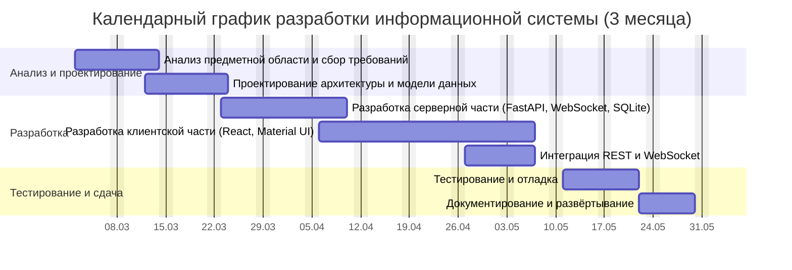

# ГЛАВА 4. ФИНАНСОВО-ЭКОНОМИЧЕСКОЕ ОБОСНОВАНИЕ ПРОЕКТА

В четвёртой главе выпускной квалификационной работы рассматривается финансово-экономическая часть проекта по созданию информационной системы поддержки процесса спортивного судейства в боевых искусствах и единоборствах. В отличие от предшествующих глав, посвящённых анализу предметной области, проектированию и технической реализации системы, настоящая глава оценивает проект с экономической точки зрения: определяет стоимость разработки приложения «с нуля» с приведением календарного графика работ, обосновывает модель монетизации продукта, рассматривает интеграцию с внешними информационными системами как фактор расширения выручки и выполняет расчёт окупаемости вложений. Изложение опирается на фактический состав работ, выполненных при создании системы, и на принятую модель её коммерческого распространения, предусматривающую взимание сбора в размере 80 рублей с каждого участника соревнования, проведённого через систему.

Цель главы — показать, что разработанная информационная система не только решает прикладную задачу автоматизации судейства, но и обладает положительной экономической отдачей: затраты на её создание окупаются в обозримый срок за счёт принятой модели монетизации, а потенциал интеграции с действующими отраслевыми системами обеспечивает дальнейший рост выручки. Все стоимостные показатели приведены в рублях Российской Федерации в ценах 2026 года; принятые допущения оговорены явно по месту их использования, что позволяет при необходимости пересчитать модель под иные исходные данные.

## 4.1 Общая характеристика финансовой модели проекта

Финансовая модель проекта строится на разделении его жизненного цикла на две фазы: фазу разработки и фазу коммерческой эксплуатации. В фазе разработки формируются единовременные (капитальные) затраты на создание программного продукта — оплата труда разработчика, амортизация используемой техники, расходы на правовую охрану результата интеллектуальной деятельности и сопутствующие издержки. Эти затраты образуют себестоимость разработки и рассматриваются как объём первоначальных инвестиций, подлежащих возмещению. В фазе коммерческой эксплуатации возникают, с одной стороны, текущие операционные затраты (хостинг облачного модуля, сопровождение, комиссии платёжных систем), а с другой — выручка от применения системы на соревнованиях, формируемая по принципу сбора с участника.

Принципиальной особенностью финансовой модели является низкая величина переменных и операционных затрат. Это обусловлено двумя архитектурными решениями, обоснованными в главах 2 и 3 настоящей работы:

1. Система построена исключительно на свободно распространяемом программном обеспечении с разрешительными лицензиями (React и Material UI — лицензия MIT, FastAPI и Uvicorn — лицензия MIT, Python — лицензия PSF, СУБД SQLite — общественное достояние). Вследствие этого расходы на приобретение лицензий на используемое программное обеспечение равны нулю как на этапе разработки, так и на этапе эксплуатации.
2. Базовый сценарий использования системы не требует серверной инфраструктуры: всё приложение функционирует в локальной сети на ноутбуке организатора. Облачные ресурсы привлекаются только для дополнительного модуля онлайн-регистрации участников, обеспечивающего сбор оплаты, а их стоимость незначительна.

Совокупность этих факторов обеспечивает высокую маржинальность модели монетизации: подавляющая часть сбора с участника формирует валовую прибыль проекта, что положительно влияет на сроки окупаемости. Дальнейшие разделы главы последовательно раскрывают каждый из элементов финансовой модели.

## 4.2 Календарный график и трудоёмкость разработки

Разработка информационной системы выполнялась одним специалистом — разработчиком полного цикла (full-stack), совмещающим проектирование, программирование серверной и клиентской частей, а также тестирование. Общая продолжительность работ составила три календарных месяца. Работы были организованы по итерационной модели, описанной в разделе 3.1, и разбиты на семь укрупнённых этапов, перечень которых с указанием длительности и трудоёмкости приведён в таблице 4.1.

Таблица 4.1 — Календарный план и трудоёмкость этапов разработки

| № | Этап работ | Длительность, раб. дн. | Трудоёмкость, ч | Период (неделя) |
|---|---|---|---|---|
| 1 | Анализ предметной области и сбор требований | 10 | 40 | 1–2 |
| 2 | Проектирование архитектуры и модели данных | 8 | 32 | 2–3 |
| 3 | Разработка серверной части (FastAPI, WebSocket, SQLite) | 14 | 76 | 4–6 |
| 4 | Разработка клиентской части (React, Material UI) | 23 | 108 | 6–9 |
| 5 | Интеграция компонентов (REST и WebSocket) | 8 | 36 | 8–9 |
| 6 | Тестирование и отладка | 9 | 48 | 10–11 |
| 7 | Документирование и развёртывание | 6 | 28 | 12–13 |
| | **Итого (с учётом совмещения этапов)** | **≈64 (3 мес.)** | **368** | **1–13** |

Суммарная трудоёмкость работ составила 368 человеко-часов. Следует отметить, что арифметическая сумма длительностей отдельных этапов (78 рабочих дней) превышает фактическую календарную продолжительность проекта (около 64 рабочих дней, что соответствует тринадцати неделям, или трём месяцам). Расхождение объясняется частичным совмещением смежных этапов: так, завершение серверной части велось параллельно с началом разработки клиентских страниц, а интеграция компонентов выполнялась по мере готовности отдельных маршрутов программного интерфейса. Среднедневная загрузка разработчика при такой организации составила около 5,7 часа, что соответствует режиму сосредоточенной работы над дипломным проектом.

Распределение работ во времени наглядно представлено на диаграмме Ганта (рисунок 4.1). Диаграмма отражает как последовательные зависимости этапов (проектирование следует за анализом требований, интеграция — за разработкой компонентов), так и их частичное перекрытие.

[Рисунок 4.1 — Диаграмма Ганта календарного графика разработки системы]

Принятая декомпозиция работ служит основой для расчёта затрат на оплату труда, выполняемого в следующем разделе: каждому этапу соответствует определённый объём человеко-часов, оплачиваемый по часовой ставке разработчика.

## 4.3 Смета затрат на разработку

Себестоимость разработки информационной системы складывается из четырёх групп затрат: затрат на оплату труда (с учётом страховых взносов), амортизации использованного оборудования, затрат на программное обеспечение и сопутствующих (прочих) расходов, включая правовую охрану результата. Ниже последовательно рассчитана каждая группа, после чего сформирована сводная смета.

### 4.3.1 Затраты на оплату труда

Затраты на оплату труда определены произведением трудоёмкости каждого этапа (таблица 4.1) на часовую ставку разработчика. Часовая ставка принята равной 700 рублей за час, что соответствует рыночному уровню вознаграждения разработчика полного цикла квалификации middle в регионах Российской Федерации в 2026 году (при пересчёте средней месячной оплаты в 110–120 тыс. рублей на эффективный фонд рабочего времени). Расчёт основной заработной платы по этапам приведён в таблице 4.2.

Таблица 4.2 — Расчёт затрат на оплату труда разработчика

| Этап работ | Трудоёмкость, ч | Ставка, руб./ч | Сумма, руб. |
|---|---|---|---|
| Анализ предметной области и сбор требований | 40 | 700 | 28 000 |
| Проектирование архитектуры и модели данных | 32 | 700 | 22 400 |
| Разработка серверной части | 76 | 700 | 53 200 |
| Разработка клиентской части | 108 | 700 | 75 600 |
| Интеграция компонентов | 36 | 700 | 25 200 |
| Тестирование и отладка | 48 | 700 | 33 600 |
| Документирование и развёртывание | 28 | 700 | 19 600 |
| **Итого основная заработная плата** | **368** | | **257 600** |

На фонд оплаты труда начисляются страховые взносы во внебюджетные фонды по совокупной ставке 30 % (пенсионное, медицинское и социальное страхование):

257 600 × 30 % = 77 280 руб.

Таким образом, полные затраты на оплату труда с учётом страховых взносов составляют:

257 600 + 77 280 = **334 880 руб.**

### 4.3.2 Амортизация оборудования

Для разработки и тестирования системы использовался комплект технических средств: ноутбук разработчика и набор мобильных устройств под управлением Android и iOS, необходимых для проверки совместимости мобильного интерфейса бокового судьи (`MobilePage`), а также Wi-Fi-маршрутизатор для воспроизведения условий локальной сети при интеграционном тестировании. Поскольку срок полезного использования техники превышает срок проекта, в себестоимость включается не полная стоимость оборудования, а сумма амортизационных отчислений за период разработки (3 месяца, или 0,25 года), рассчитанная линейным методом. Расчёт приведён в таблице 4.3.

Таблица 4.3 — Расчёт амортизации оборудования за период разработки

| Оборудование | Назначение | Стоимость, руб. | СПИ, лет | Амортизация за 3 мес., руб. |
|---|---|---|---|---|
| Ноутбук разработчика | Программирование, сборка, отладка | 80 000 | 3 | 6 667 |
| Смартфон Android | Тестирование мобильного интерфейса | 25 000 | 3 | 2 083 |
| Смартфон iOS | Тестирование кроссбраузерной совместимости | 60 000 | 3 | 5 000 |
| Wi-Fi-маршрутизатор | Интеграционное тестирование в локальной сети | 4 000 | 5 | 200 |
| **Итого** | | **169 000** | | **13 950** |

### 4.3.3 Затраты на программное обеспечение и прочие расходы

Как отмечено в разделе 4.1, весь технологический стек системы основан на свободно распространяемом программном обеспечении, поэтому затраты на лицензии равны нулю. Среда разработки (редактор Visual Studio Code, система контроля версий Git, браузеры для отладки) также не требует лицензионных платежей.

К прочим затратам периода разработки отнесены расходы на электроэнергию и услуги связи (доступ в Интернет для изучения документации и работы с репозиторием) из расчёта 2 000 рублей в месяц, а также затраты на правовую охрану результата интеллектуальной деятельности — государственная регистрация программы для ЭВМ в Роспатенте, обеспечивающая закрепление исключительных прав на разработанное приложение (государственная пошлина и подготовка заявки). Перечень прочих затрат приведён в таблице 4.4.

Таблица 4.4 — Затраты на программное обеспечение и прочие расходы

| Статья | Сумма, руб. |
|---|---|
| Лицензии на программное обеспечение (открытый стек) | 0 |
| Электроэнергия и услуги связи (3 мес. × 2 000) | 6 000 |
| Государственная регистрация программы для ЭВМ в Роспатенте | 4 500 |
| **Итого** | **10 500** |

### 4.3.4 Сводная смета и себестоимость разработки

Сводная смета затрат на разработку информационной системы получена суммированием рассчитанных групп затрат. Дополнительно учтены накладные расходы в размере 5 % от суммы прямых затрат, отражающие непредвиденные издержки и организационные расходы, не выделенные в отдельные статьи. Итоговая смета приведена в таблице 4.5.

Таблица 4.5 — Сводная смета затрат на разработку

| Статья затрат | Сумма, руб. | Доля, % |
|---|---|---|
| Оплата труда с учётом страховых взносов | 334 880 | 88,8 |
| Амортизация оборудования | 13 950 | 3,7 |
| Лицензии на программное обеспечение | 0 | 0,0 |
| Электроэнергия и услуги связи | 6 000 | 1,6 |
| Государственная регистрация программы для ЭВМ | 4 500 | 1,2 |
| Накладные расходы (5 % от прямых затрат) | 17 967 | 4,7 |
| **Итого себестоимость разработки** | **377 297** | **100,0** |

Таким образом, полная стоимость разработки информационной системы «с нуля» составляет приблизительно **377,3 тыс. рублей**. Из структуры сметы видно, что определяющей статьёй (около 89 %) являются затраты на оплату труда разработчика, что характерно для проектов создания программного обеспечения, где основным ресурсом выступает квалифицированный труд, а не материальные активы. Нулевые лицензионные расходы подтверждают экономическую целесообразность выбранного открытого технологического стека: при использовании коммерческих аналогов средств разработки и СУБД смета возросла бы на сопоставимую с амортизацией величину.

Полученная сумма 377 297 рублей принимается далее как объём первоначальных инвестиций, подлежащих возмещению в фазе коммерческой эксплуатации.

## 4.4 Модель монетизации и формирование выручки

В качестве основной модели монетизации продукта принята транзакционная модель со сбором, взимаемым с каждого участника соревнования, проведённого через систему. Размер сбора установлен на уровне **80 рублей за одного участника**. Организатор соревнования (спортивный клуб, региональная федерация, оргкомитет турнира) использует систему для электронного судейства и регистрации участников, а правообладатель системы получает вознаграждение пропорционально числу зарегистрированных и фактически проведённых через систему спортсменов.

Выбор транзакционной модели вместо разовой продажи лицензии обоснован следующими соображениями:

1. **Низкий порог входа для организатора.** Организатору не требуется единовременно нести существенные затраты на приобретение лицензии; оплата привязана к фактическому масштабу мероприятия, что особенно важно для небольших клубов и соревнований муниципального уровня, упомянутых в главе 1 как значимый сегмент целевой аудитории.
2. **Справедливое распределение стоимости.** Сбор в 80 рублей соразмерен с организационным взносом, который участники и без того уплачивают за участие в соревнованиях, и составляет его малую долю; для организатора он легко включается в стартовый взнос и не воспринимается участником как отдельная нагрузка.
3. **Масштабируемость дохода.** Выручка правообладателя растёт вместе с числом проводимых мероприятий и количеством участников, то есть с ростом полезности системы для отрасли, что согласует интересы разработчика и пользователей.

Единичная экономика модели приведена в таблице 4.6. Поскольку сбор взимается через модуль онлайн-регистрации, на каждого участника приходятся незначительные переменные затраты: комиссия платёжной системы (эквайринг, Система быстрых платежей) и доля затрат на трафик и хранение данных. Эти переменные затраты оценены суммарно в 5 рублей на участника, что даёт маржинальную прибыль 75 рублей с каждого участника.

Таблица 4.6 — Единичная экономика (на одного участника)

| Показатель | Значение, руб. |
|---|---|
| Сбор с участника (выручка) | 80 |
| Комиссия платёжной системы и эквайринг (≈3 %) | 3 |
| Затраты на трафик, хранение и обработку данных | 2 |
| **Маржинальная прибыль с участника** | **75** |

Высокая маржинальность (около 94 % от величины сбора) является прямым следствием низких операционных затрат, обоснованных в разделе 4.1. Это означает, что подавляющая часть выручки направляется на возмещение первоначальных инвестиций и формирование прибыли, что благоприятно сказывается на сроке окупаемости (раздел 4.7).

Помимо основной транзакционной модели, продукт допускает дополнительные источники дохода, которые могут применяться параллельно и рассматриваются как резерв роста выручки:

- **Подписка для федераций и крупных организаторов** — фиксированная годовая плата с безлимитным числом участников, выгодная для тех, кто проводит большое количество мероприятий;
- **Платные расширения (модель Freemium)** — дополнительные функции (история поединков, экспорт протоколов в форматы PDF и Excel, статистика судей, одновременное обслуживание нескольких татами), предоставляемые за отдельную плату при бесплатном базовом функционале;
- **Партнёрские отчисления** — вознаграждение за интеграцию системы в инфраструктуру крупных турниров и платформ управления соревнованиями (см. раздел 4.5).

В рамках настоящего расчёта в качестве базового источника выручки принимается транзакционный сбор 80 рублей с участника; дополнительные источники в количественную модель окупаемости консервативно не включаются, что обеспечивает её осторожную оценку «снизу».

## 4.5 Интеграция с внешними системами как фактор роста выручки

Существенным резервом расширения выручки и повышения ценности продукта является интеграция разработанной системы с действующими отраслевыми информационными системами. Сама по себе функция электронного судейства, реализованная в системе, представляет собой завершающее звено цепочки организации соревнования; встраивание этого звена в общий контур информационного обеспечения спортивного мероприятия многократно увеличивает число участников, проходящих через систему, и, следовательно, объём транзакционной выручки. Перспективные направления интеграции перечислены ниже.

1. **Системы регистрации и заявок федераций.** Интеграция с системами приёма заявок спортивных федераций (в частности, по армейскому рукопашному бою) и со всероссийским реестром спортсменов позволяет автоматически импортировать заявочные списки участников непосредственно в справочник системы, описанный в разделе 3.2. Это устраняет ручной ввод фамилий, синхронизирует данные о спортсменах и обеспечивает естественную точку взимания сбора — на этапе подтверждения заявки. Именно эта интеграция напрямую увеличивает базу участников, с которых взимается сбор 80 рублей.

2. **Платёжные системы.** Подключение эквайринга и Системы быстрых платежей (СБП), а также онлайн-касс реализует фактический сбор оплаты с участника или организатора и формирует фискальную отчётность. Без платёжной интеграции транзакционная модель монетизации технически нереализуема, поэтому данное направление является обязательным для коммерческой эксплуатации.

3. **Системы управления соревнованиями.** Интеграция с программами жеребьёвки и формирования турнирных сеток (брекетов) позволяет передавать в систему судейства расписание поединков, а обратно — результаты, автоматически продвигая участников по сетке. Это превращает разработанное приложение из автономного инструмента судейства в компонент сквозного процесса проведения турнира и делает его привлекательным для крупных организаторов.

4. **Системы спортивной квалификации.** Передача электронных протоколов поединков в системы учёта результатов для присвоения спортивных разрядов и званий (в соответствии с Единой всероссийской спортивной классификацией) избавляет секретариат от ручного оформления документов и повышает доверие к результатам, зафиксированным системой.

5. **Системы бухгалтерского учёта.** Интеграция с продуктами семейства «1С» обеспечивает автоматическое формирование финансовой и управленческой отчётности по собранным взносам, что важно для организаторов, действующих как юридические лица.

6. **Системы трансляции и видеоповтора.** Передача текущего счёта и хода поединка в графическое оформление онлайн-трансляции (титры, табло для зрителей) повышает зрелищность мероприятия и создаёт основу для медийной монетизации, а интеграция с системами видеофиксации — для разбора спорных эпизодов.

Техническая предпосылка для перечисленных интеграций уже заложена в архитектуре системы: серверная часть реализована на основе REST-интерфейса с автоматически генерируемой документацией (раздел 3.2), что упрощает подключение внешних потребителей данных и предоставление программного интерфейса (API) партнёрам. Развитие интеграционных возможностей переводит продукт от обслуживания отдельных соревнований к обслуживанию целых турнирных серий и календарей федераций, что в сценарном анализе следующего раздела соответствует переходу от пессимистического к оптимистическому сценарию по числу участников.

## 4.6 Прогноз выручки и сценарный анализ

Прогноз выручки построен на основе числа участников, проходящих через систему за год, и величины сбора 80 рублей с участника. Среднее число участников одного соревнования принято дифференцированно по уровню мероприятия: муниципальные турниры — порядка 70 участников, региональные — около 100–130 участников. Для оценки годовой выручки сформированы три сценария, различающиеся числом обслуживаемых за год соревнований и их средней наполненностью (таблица 4.7).

Таблица 4.7 — Сценарии годовой выручки (сбор 80 руб./участник)

| Сценарий | Соревнований в год | Ср. участников | Участников в год | Годовая выручка, руб. |
|---|---|---|---|---|
| Пессимистический | 25 | 70 | 1 750 | 140 000 |
| Базовый | 60 | 100 | 6 000 | 480 000 |
| Оптимистический | 120 | 130 | 15 600 | 1 248 000 |

Сценарии отражают различную глубину проникновения продукта на рынок: пессимистический соответствует пилотному внедрению в нескольких клубах; базовый — устойчивому использованию системы региональными организаторами и одной-двумя федерациями; оптимистический — широкому распространению с подключением интеграций, описанных в разделе 4.5, и переходу к обслуживанию турнирных серий.

С учётом постепенного наращивания клиентской базы прогноз на трёхлетний горизонт принят с ежегодным ростом числа участников: за базовый первый год — 6 000 участников, второй год — 12 000, третий год — 20 000. Для оценки прибыли из выручки вычтены переменные затраты (5 руб./участник, таблица 4.6) и постоянные операционные затраты фазы эксплуатации, включающие хостинг облачного модуля регистрации, доменное имя, сертификаты и сопровождение системы (около 90 тыс. рублей в первый год с умеренным ростом в последующие). Результаты приведены в таблице 4.8.

Таблица 4.8 — Прогноз финансовых результатов на 3 года (базовый сценарий)

| Показатель | 1-й год | 2-й год | 3-й год |
|---|---|---|---|
| Участников за год | 6 000 | 12 000 | 20 000 |
| Выручка, руб. | 480 000 | 960 000 | 1 600 000 |
| Переменные затраты, руб. | 30 000 | 60 000 | 100 000 |
| Постоянные операционные затраты, руб. | 90 000 | 110 000 | 140 000 |
| **Чистый денежный поток за год, руб.** | **360 000** | **790 000** | **1 360 000** |
| Накопленный поток с учётом инвестиций (−377 297), руб. | −17 297 | 772 703 | 2 132 703 |

Как видно из таблицы 4.8, уже к концу первого года коммерческой эксплуатации накопленный денежный поток практически компенсирует первоначальные инвестиции (остаток составляет всего около −17 тыс. рублей), а со второго года проект выходит в устойчивую прибыль. Детальная динамика возмещения инвестиций в течение первого года рассмотрена в следующем разделе.

## 4.7 Расчёт окупаемости и точки безубыточности

Точка безубыточности по числу участников определяется как объём участников, маржинальная прибыль с которых покрывает первоначальные инвестиции в разработку. При маржинальной прибыли 75 рублей с участника (таблица 4.6) и инвестициях 377 297 рублей:

N_безуб = 377 297 / 75 ≈ **5 031 участник.**

Иными словами, для полного возмещения затрат на разработку через систему должно пройти около пяти тысяч участников. В базовом сценарии (6 000 участников в год) этот объём достигается примерно за 10 месяцев работы по маржинальной прибыли; с учётом постоянных операционных затрат фазы эксплуатации (таблица 4.8) срок простой окупаемости несколько увеличивается и составляет около **13 месяцев** — то есть инвестиции возмещаются в течение немногим более одного года.

Для иллюстрации внутригодовой динамики в таблице 4.9 приведён поквартальный денежный поток первого года с учётом постепенного наращивания числа обслуживаемых соревнований (от пилотных мероприятий в первом квартале к выходу на проектную мощность в четвёртом). Постоянные операционные затраты распределены равномерно по 22,5 тыс. рублей в квартал, переменные приняты из расчёта 5 руб./участник.

Таблица 4.9 — Поквартальный денежный поток за первый год (базовый сценарий)

| Период | Участников | Выручка, руб. | Переменные + постоянные затраты, руб. | Чистый поток, руб. | Накопленный поток, руб. |
|---|---|---|---|---|---|
| Первоначальные инвестиции | — | — | — | −377 297 | −377 297 |
| I квартал | 600 | 48 000 | 25 500 | 22 500 | −354 797 |
| II квартал | 1 200 | 96 000 | 28 500 | 67 500 | −287 297 |
| III квартал | 1 800 | 144 000 | 31 500 | 112 500 | −174 797 |
| IV квартал | 2 400 | 192 000 | 34 500 | 157 500 | −17 297 |

Из таблицы 4.9 видно, что накопленный денежный поток монотонно приближается к нулю и достигает положительных значений в начале второго года эксплуатации, что подтверждает срок окупаемости порядка 13 месяцев. Графически момент пересечения накопленным потоком нулевой отметки соответствует точке окупаемости проекта (рисунок 4.2).

[Рисунок 4.2 — Динамика накопленного денежного потока и точка окупаемости проекта]

Чувствительность срока окупаемости к сценарию выручки иллюстрирует таблица 4.10: при пессимистическом сценарии возмещение инвестиций растягивается на несколько лет, тогда как при оптимистическом — наступает в течение первого полугодия эксплуатации. Это подчёркивает значение мер по продвижению продукта и развитию интеграций (раздел 4.5), смещающих проект к верхним сценариям.

Таблица 4.10 — Срок окупаемости по сценариям

| Сценарий | Участников в год | Годовая маржинальная прибыль, руб. | Срок окупаемости (ориентировочно) |
|---|---|---|---|
| Пессимистический | 1 750 | 131 250 | около 3 лет |
| Базовый | 6 000 | 450 000 | около 13 месяцев |
| Оптимистический | 15 600 | 1 170 000 | около 5 месяцев |

Даже в наименее благоприятном сценарии проект окупается в пределах трёх лет, что для программного продукта с многолетним сроком эксплуатации является приемлемым результатом; в базовом и оптимистическом сценариях окупаемость наступает существенно быстрее. С учётом нулевых лицензионных затрат и низких операционных издержек разработанная система демонстрирует высокую экономическую эффективность и инвестиционную привлекательность.

## 4.8 Выводы по главе

В четвёртой главе выпускной квалификационной работы выполнено финансово-экономическое обоснование проекта создания информационной системы поддержки процесса спортивного судейства. По результатам проведённых расчётов можно сформулировать следующие выводы.

1. Составлен календарный график разработки продолжительностью три месяца, включающий семь укрупнённых этапов общей трудоёмкостью 368 человеко-часов; график представлен в виде календарного плана и диаграммы Ганта с учётом частичного совмещения смежных этапов.

2. Сформирована сводная смета затрат на разработку, согласно которой полная стоимость создания системы «с нуля» составляет около 377,3 тыс. рублей. Определяющей статьёй (около 89 %) являются затраты на оплату труда; лицензионные расходы равны нулю благодаря выбору открытого технологического стека, что подтверждает экономическую обоснованность принятых в главах 2 и 3 технических решений.

3. Обоснована транзакционная модель монетизации со сбором 80 рублей с каждого участника соревнования. Низкие операционные затраты обеспечивают высокую маржинальность модели — около 75 рублей валовой прибыли с участника, что благоприятно сказывается на сроке окупаемости.

4. Рассмотрена интеграция системы с внешними информационными системами — системами регистрации федераций, платёжными системами, программами управления соревнованиями, системами спортивной квалификации, бухгалтерского учёта и трансляции — как ключевой фактор расширения базы участников и роста выручки; техническая основа для интеграций заложена в REST-архитектуре серверной части.

5. Выполнен прогноз выручки по трём сценариям и расчёт окупаемости. Точка безубыточности достигается при прохождении через систему около 5 000 участников; в базовом сценарии (6 000 участников в год) первоначальные инвестиции возмещаются примерно за 13 месяцев, в оптимистическом — за 5 месяцев, в пессимистическом — в пределах трёх лет.

Таким образом, разработанная информационная система обладает не только технической работоспособностью, подтверждённой в третьей главе, но и положительной экономической отдачей: затраты на её создание окупаются в обозримый срок за счёт принятой модели монетизации, а потенциал интеграции с действующими отраслевыми системами обеспечивает дальнейший рост выручки и устойчивость проекта в долгосрочной перспективе.
